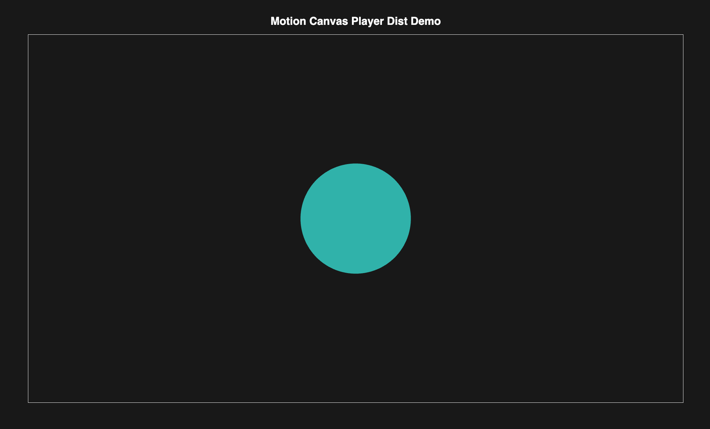

# Motion Canvas Player Dist

This project builds and bundles the Motion Canvas Player so that it can easily be included in other projects or homepages.
Note that this does not build the actual project which needs to be built seperately.
Though an example project built for version 3.17.2 is included in the demo.

See [index.html](demo/index.html) for an exemplary usage.
Please have a look at [MotionCanvasPlayerProps](https://github.com/motion-canvas/motion-canvas/blob/main/packages/player/types/main.d.ts) for the available attributes on the element.


## Build and Copy Dist Files
Build and copy files to local *dist* directory: 

```bash
docker build --target dist . -t mc_player_dist
container_id=$(docker create mc_player_dist)
rm -r dist && docker cp $container_id:/dist ./dist
docker rm $container_id
```

## Run Demo
Build the demo and run it locally:
```bash
docker build --target demo . -t mc_player_dist_demo && docker run --rm -p 8080:8080 mc_player_dist_demo 
```
Then visit [http://localhost:8080/](http://localhost:8080/).

It should look like this:


## Specify Motion Canvas Version:

You can use the build argument MC_VERSION to specify the motion canvas version when building the image, e.g., 3.18.0-alpha.0 (3.17.2 is the current default):

```bash
docker build --target dist . -t mc_player_dist --build-arg MC_VERSION="3.18.0-alpha.0"
```
Note that the included project might not work with the specified version. 

## Todos
- Add example projects for other Motion Canvas versions
- Add notes on other ways to include Motion Canvas in projects